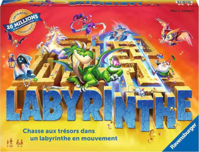
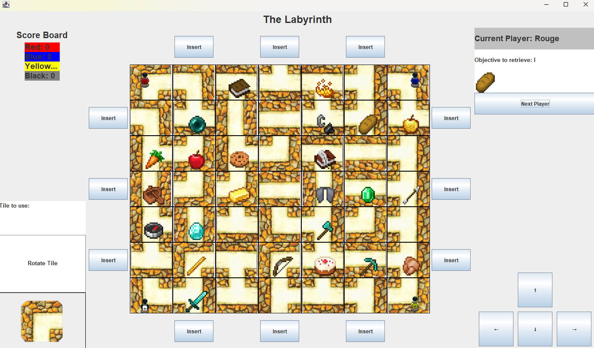

# Project: Labyrinth Board Game in Java

  
  
  

This project was developed as part of a school assignment. Our objective was to develop the **Labyrinth** board game in Java, using **Java Swing** for the graphical interface. We also had to respect design principles and apply **design patterns** to produce maintainable, reusable code.

First of all, if you're unfamiliar with the Labyrinth game and its rules, here are two useful resources:
- An [explanatory video](https://www.youtube.com/watch?v=sbBjW0wtNz8).  
- The [official game rules](https://www.ravensburger.de/spielanleitungen/ecm/Spielanleitungen/Labyrinth.pdf).

---

You will also find the project's PUML diagram and the JavaDoc (simply open `index.html` in the `JavaDoc` folder).  

To run the game, you will need a development environment. Personally, I use IntelliJ IDEA.  

If you have a JDK version above 21 (check by navigating to **Project Structure -> Project -> SDK**), you can run the game by executing the `main` method or the `Labyrinthe.jar` file located in `Labyrinth\Labyrinthe\out\artifacts\Labyrinthe_jar` directly from your IDE.

---

## Design Report

This report details the design of the application, which is based on a modular, object-oriented architecture. We used the **MVC, Observer and Factory** design patterns to meet the requirements of modularity, reusability and testability.

---

## Structure and Design Patterns

### 1. MVC Architecture
The application follows a **Model-View-Controller (MVC)** architecture:  
- **Model**: Manages the state and logic (e.g., players, board, objectives).  
- **View**: Handles the user interface (based on Swing) and displays the model data.  
- **Controller**: Coordinates user interactions, triggers model updates and synchronizes the views.

#### Benefits:  
- **Separation of responsibilities**: The user interface can evolve without impacting the core logic.  
- **Testability**: Models and controllers can be tested independently from the views.  

This architecture is particularly suitable for applications requiring dynamic interfaces and clear interaction management.

---

### 2. Observer Pattern
The **Observer pattern** is used to synchronize the models and views:  
- **Models** such as `GameState` and `Board` notify their **observers** (e.g., `InterfaceSwing`) whenever there is a state change.  
- Two types of observers have been implemented:  
  - **`ObserverGame`**: Monitors the players' state.  
  - **`ObserverBoard`**: Monitors board updates.

#### Benefits:  
- **Decoupling**: Models are not view-dependent, making them easy to reuse. 
- **Extensibility**: New views can be added without modifying existing models.

---

### 3. Factory Pattern
The **Factory pattern** is used in `TileFactory` to create different types of tiles (`TileRight`, `TileCorner`, etc.).

#### Benefits:  
- **Reusability**: Centralized tile creation logic makes the code clearer and more maintainable.  
- **Flexibility**: Changes to tile types are confined to the `TileFactory`.

---

## Class Details

### Models  
- **`GameState`**: Manages the global state of the game (players, board, current turn).  
- **`Board`**: Responsible for tiles and movements on the board.  
- **`Player`**: Represents a player (position, objectives, score).  
- **`Objective`**: Defines game objectives and assigns them to players.  
- **`Tile` and `TileFactory`**: Represent board tiles and their creation.  
- **`ObserverGame` and `ObserverBoard`**: Implement the Observer pattern to synchronize models and views.

### Views  
- **`InterfaceSwing`**: Main component of the user interface.  
- **`SwingComponent`**: Contains modular sub-components (`CurrentPlayerView`, `ScoreBoard`, `Board`, `MovementArrows`), simplifying maintenance and interface evolution.

### Controllers  
Three distinct controllers organize interactions:  
- **`GameController`**: Manages global actions (turn management, end-of-game conditions).  
- **`TileController`**: Handles tile interactions (rotation, movement).  
- **`ObjectiveController`**: Manages the assignment and tracking of player objectives.

---

## Conclusion
This design is based on a clear separation of responsibilities and respects the principles of object-oriented programming (modularity, reusability). It ensures the application is scalable, maintainable, and extensible.

---

### Created by:  
- **Belhaj Amine**  
- **Delaye Auguste**
